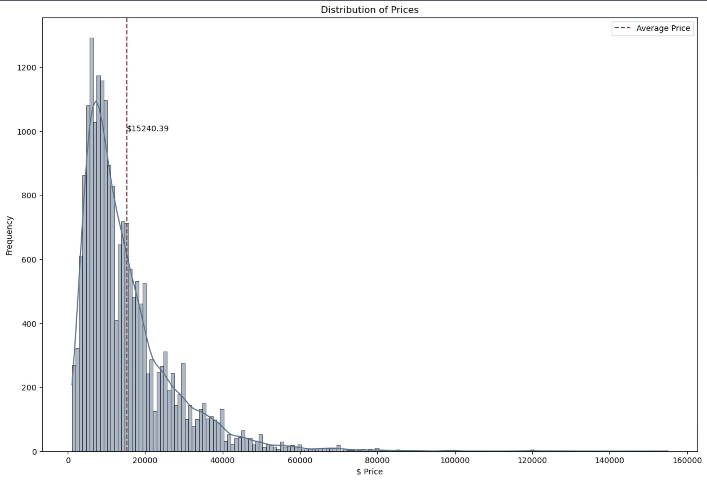
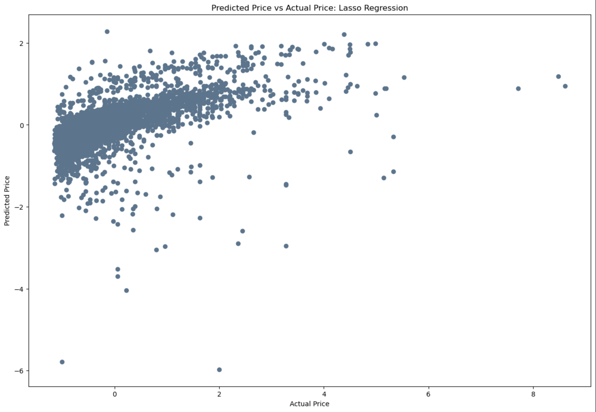
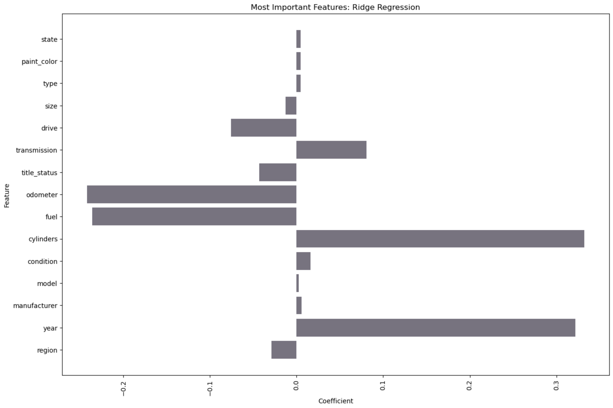
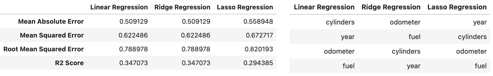
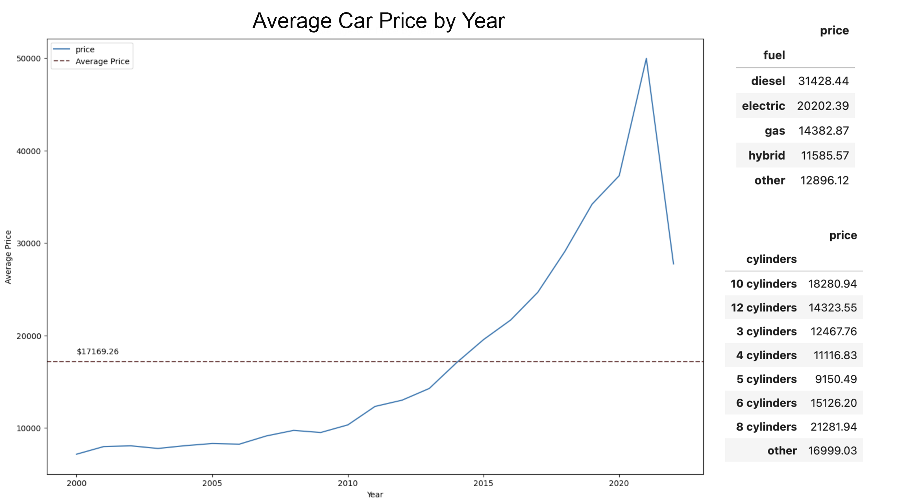
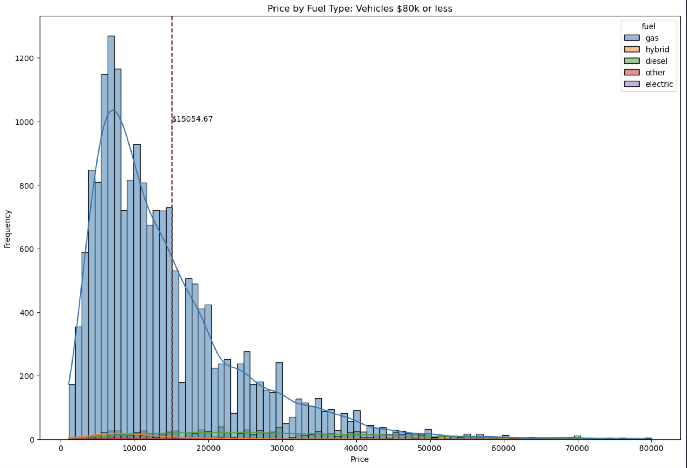
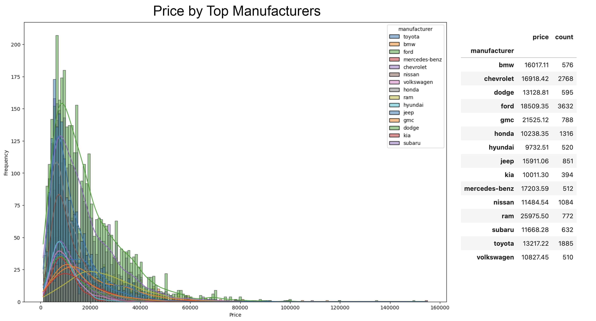

# Predicting Car Prices with Regression 
This project was part of an assignment for a Machine Learning course.  The [Vehicle Data](./data/vehicles.csv) is included in the repository and was sourced from Kaggle.  The exact origin was not specified.

The included [Jupyter Notebook](AF_Car_Price_Analysis.ipynb) contains the code used to complete the following regression analysis.

## Business Understanding

The car dataset will be used to gain insights into key drivers for used car prices.  

The following analysis will clarify which vehicle features positively or negatively impact a car's value (price).  Understanding the correlation between the vehicle features and the resulting prices will create a predictive model to price vehicles the dealership lists for sale accurately.  Additionally, understanding desirable vehicle traits will allow the dealership to make more informed inventory decisions.

## Understanding the data
The first step of this project was to understand the data.  The data set contained nearly 427k records and included the following vehicle features:

**Vehicle Features:**
id, price, year, manufacturer, model, condition, cylinders, fuel, title_status, transmission, VIN, drive, size, type, paint_color, and state
 
Time was spent looking through the unique values of each feature, particularly the categorical columns such as manufacturer, model, and fuel, to understand the depth and detail of the vehicle information.

A price distribution histogram gave a quick overview of the vehicle pricing and quickly identified outliers.  When reviewing the top 20 and bottom 20 vehicles by price, I found a Ford Escape valued at $150,000.  Additionally, there were many $1 values at the low end of the pricing level, in addition to "like new" vehicles priced under $2000.  I removed these vehicles from the dataset.

I additionally reviewed the list of unique models for Ford vehicles, as this manufacturer had a very high model count.  I concluded that Ford has the broadest range of identified models.

## Data Preparation
In addition to outlier cleaning from the data understanding process, I converted categorical data into numeric values using the label encoder.  Previously, I had used the one hot encoder method, but the replication of columns made this method less ideal in this instance.  Once categorical data was enumerated, an additional data type conversion of odometer and year to int64 was completed.

The new, clean data was placed into a new dataframe called "cars_clean" and then inspected for accuracy.

After previewing the cleaned car data, the data was scaled using the Standard Scaler.  A quick review of the scaled data was conducted, including creating a simple Correlation Matrix for initial data testing.  

## Data Modeling
The cleaned data was divided into target and feature (X and y), and then split into test and training data.  I began with a simple linear regression model, followed by a ridge regression model, and ended with a Lasso Regression, including cross-validation.  I created a scatterplot of each model to visualize the results of these models.  Below is the scatterplot of predicted vs actual prices for the Lasso Regression model.

Below is a bar chart clearly illustrating the weights of the features:

## Evaluation
I calculated the results of each model and found that all three regression models determined the year, cylinders, odometer and fuel features as most important, although in varying orders of importance.  The Lasso Regression model performed the best, although the others performed similarly well.

Upon reviewing the scatterplot of the various models, there could be an argument to remove an additional layer of outliers in addition to the dataset.  Namely, any vehicles before the year 2000 had either very high (classic collector cars) or extremely low (beater cars) values.  A secondary model could be created to split out this other set of vehicles, allowing a dealership to treat these uniquely classified cars as their own independent dataset.

## Deployment
Based on the evaluation of the data models, the following features have the greatest importance for predicting value:

**Most Important Features**  
- Year
- Cylinders (12, 10, 8, 6, 4, 3, other)
- Odometer (mileage)
- Fuel (diesel, gas, hybrid, electric, other)

The graph below has been filtered to only include vehicles from 2000 until the present.  Trend lines for the vehicle price by year have poor predictability, as these vehicles fall into one of two extremes: classic collector vehicles or cars that are likely most valuable as scrap.

The average price by cylinder and fuel type is also included below to illustrate the correlation of these factors clearly.

While fuel type impacts price, it is worth noting that most of the vehicles in this dataset were gas-powered.

The manufacturer was not included as a top correlating factor to price, but knowing the most popular vehicle manufacturers and their associated pricing spread should be another helpful tool for your inventory strategy.

My recommendations are to take the results of this model and create an app in Streamlit to allow for easier inputs of vehicle data to predict pricing.  Based on the analysis, the data could be trimmed down to the following columns:
- Year
- Cylinders
- Odometer 
- Fuel
- Manufacturer
- Vin (to be used as the unique identifier)

As mentioned previously, we should also consider creating two regression models, one to handle more typical vehicles and another to handle vehicles considered collector or exotic.

